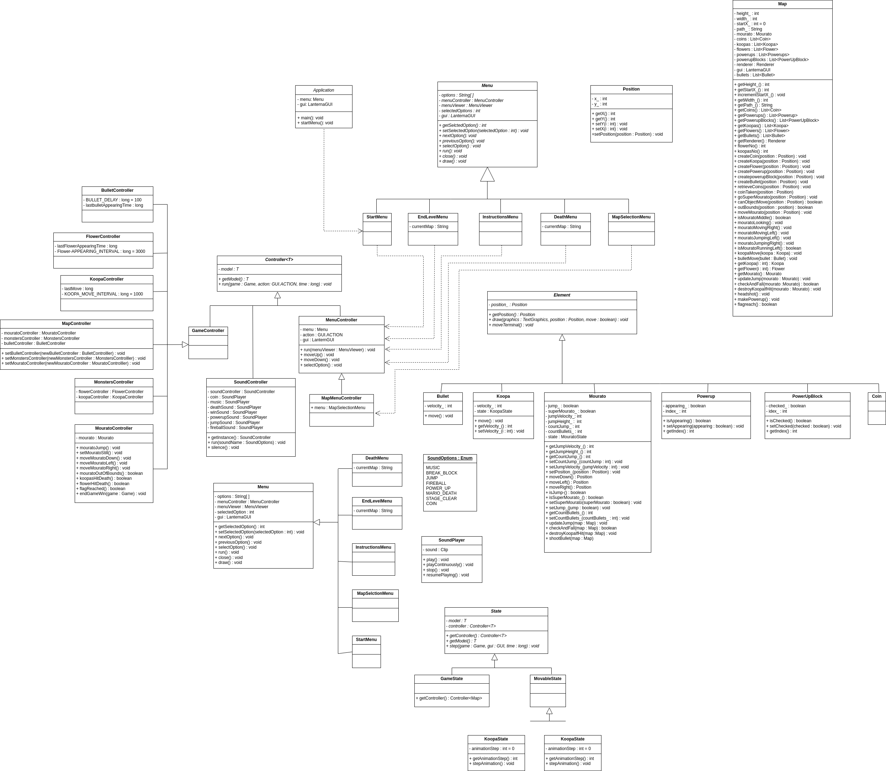

 # LDTS_T06_G01 - SUPER MOURATO
## UML DESIGN

  

  <b><i>Fig 6 classUML </i></b>

## Implemented Features

- **Connected Menus** - The user has the capability of browsing through the different menus including in game ones. (Ex: Main Menu, Instructions, Play, Death, Win).
- **Buttons** - Functional and interactive buttons.
- **Keyboard control** - The mouse and keyboard inputs are received through the respective events and interpreted according to the current game state.
- **Player control** - The player may move with the keyboard control and shoot his gun when the 'x' is pressed
- **Collisions detection** - Collisions between different objects are verified. (Ex: Blocks)
- **Different levels** - 4 different levels with an increasing difficulty were implemented.
- **Gravity**- Everytime mourato jumps, we will fall automatically.
- **Moving Terminal**- The maps dont fit in the terminal size so, the terminal moves as it detects when mourato is in the middle of the screen. When you see the flag, it will stop and you can go grab that win!
- **Animations** - Several animations are incorporated in this game, from walking to jumping mourato 

## Planned Features

All the planned features were successfully implemented.

## Design

### General Structure
#### Problem in Context:
The first concern of our project was how the structure would look like. Since our game is dealling with a GUI and is divided by different menus some specific patterns came to mind in order to fullfil our needs the best way possible.

#### The Pattern:
Two main patterns were applied to the project, the **_Architectural Pattern_**, more specifically the Model-View-Controller style which is commonly used in a GUI and the **_State Pattern_** which is a behavioral design pattern that lets an object alter its behavior when its internal state changes.  

#### Implementation:
Regarding the implementation, we now have classes which main purpose is to store data (model), classes that control the logic of the game (controllers) and classes that are responsible for the visual effects on the screen (viewers).

#### Consequences:
The use of these patterns in the current design allow the following benefits:
- A well organized code acknowledging the Single Responsibility Principle.
- Easy to add new features throughout the development stage.

### Observers and listeners
#### Problem in Context:  
Our game is controlled by the keyboard, many are the ways to receive input from these devices, for example: a thread that is running and every time it catches a signal it sends to the game itself (polling), the game being responsible for asking for input when needed, which is costly for our program since we may not send any signal to the program and unnecessary calls are made or the way we decided to implement which consists of using observers also known as listeners that are responsible for receiving the said input and redistributing it in a nicer and more usefull way to us. This takes some "weight" of the program as it will no longer need to be polling for input, as it will be properly warned when received.

#### The Pattern:
We have applied the **_Observer pattern_** which is a behavioral design pattern that lets you define a subscription mechanism to notify multiple objects about any events that happen to the object they’re observing. With this in mind the pattern allowed to solve the identified problems and apply a sustainable mechanism to receive any program input.

#### Implementation:
Implementation wise we store the observers in the main class (game class) and change its state according to the respective input processed by the available listener.

#### Consequences:
Some consequences of using the stated pattern:
- Promotes the single responsibility principle.
- Clean code.
- Only the current game state is warned when an input is given.

### Object Rendering
#### Problem in Context:

The map features various types of blocks, each with specific requirements for interaction, all of which needed to be read before the game could run.

#### The Pattern:
The **Factory method pattern** is a creational design pattern that allows you to construct complex objects step by step making a simpler code.

#### Implementation:
The method leverages factory methods like map.createCoin, map.createKoopa, and so on to create specific game objects (e.g., coins, Koopas, power-ups). Each of these methods encapsulates the instantiation logic, promoting loose coupling and making it easier to manage and extend the creation process.

#### Consequences:
Benefits of applying the above pattern:
- New types of objects can be added with minimal changes, as the creation logic is separated into methods (createCoin, createKoopa, etc.).
- The rendering method focuses solely on interpreting the map and calling the relevant creation methods, keeping the logic modular and maintainable.
- This approach allows the map and its rules to scale without deeply intertwining with the rendering logic.

### Elements representing different states
#### **Problem in Context:** 
A few Elements will exhibit different states based on his movements and reactions to keyboard inputs. These states have to dynamically change depending on how the player interacts with the controls, ensuring a responsive and engaging gameplay experience.

#### The Pattern:
We have applied the **State** also know as Action pattern, that lets the program know the Game should draw the elements.

#### Implementation:
The State will evaluate the current status of the Element and accurately determine its state. It will then notify the object of its current state, ensuring the object remains aware of its context. The renderer will subsequently use this information to adjust its behavior or visual representation accordingly, creating a seamless and responsive interaction.

#### Consequences:
The State Pattern allows the following consequences:
- Improves Readability and Organization
- Facilitates Transitions Between States
- Encapsulates State-Specific Behavior

### GUI
#### Problem in Context:
Aiming for a structured and unstable (easy to change) code, we tried to make it as general as possible. The lanterna library contains various functions that aren't useful to our program, Interface Segregation Principle violation, and lacks some other functions that our interface needs. Also, if using the raw library, our game (high level module) would be directly depending on a low level module. This is a violation of the Dependency Inversion Principle (DIP). A need to implement an interface that solves these problems was born. 

#### The Pattern: 
We have applied the **_Facade_** pattern. A facade provides a simple interface to a complex subsystem which contains lots of moving parts, allowing us to only include the features that really matter.

#### Consequences: 
The use of the Facade Pattern in the current design allows the following benefits:
- Isolate code from the complexity of a subsystem.
- Promotes testability and replaceability.
- Expand lanterna functionalities as well as respecting the Interface Segregation Principle.

## Known-code smells

We have fixed all the errors reported by error-prone . No other major code smells identified. 

## Testing

### Screenshot of coverage report

  

  <b><i>Fig 7. Code coverage screenshot</i></b>

### Screenshot of pitest report

  

  <b><i>Fig 8. pitest coverage screenshot</i></b>

## Self-evaluation

The work was divided in a mutual way and we all contributed with our best. It helped us to enrich our java and principle/pattern knwoledge, as well as our team work.

- Pedro Ribas: 33.3%
- Paulo Mourato: 33.3%
- Simao Ribeiro: 33.3%

